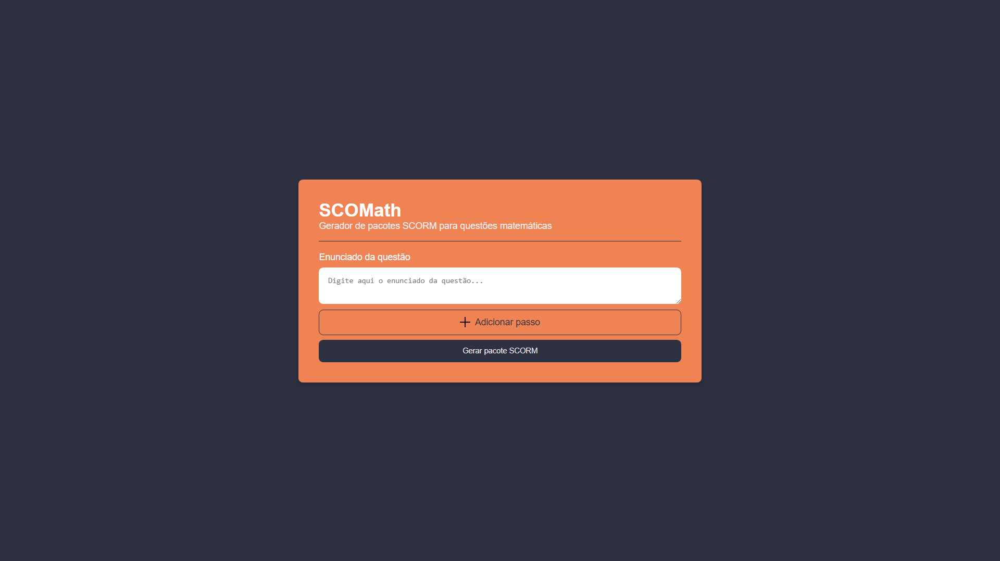
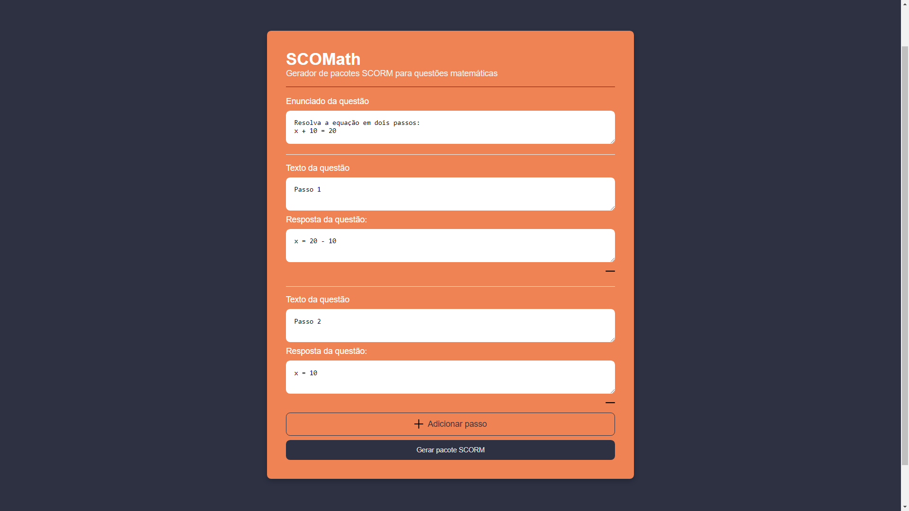
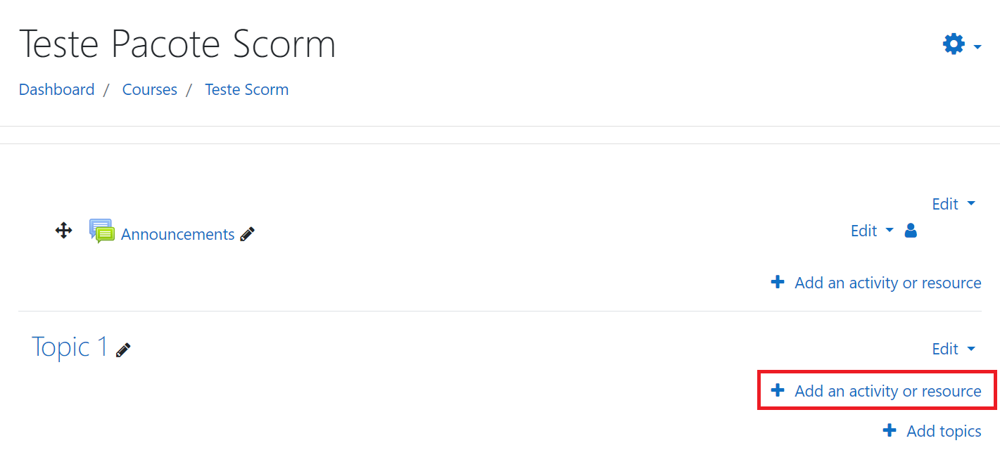
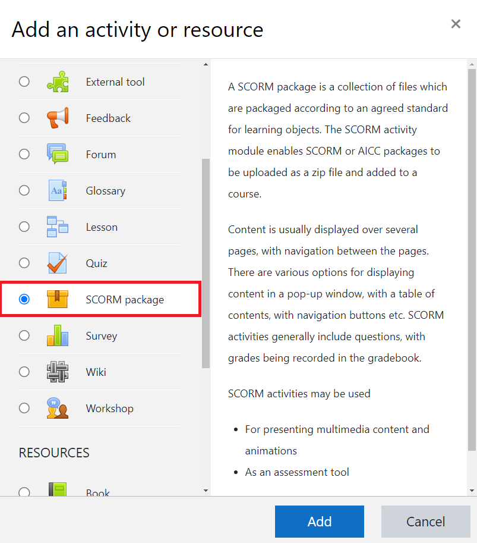
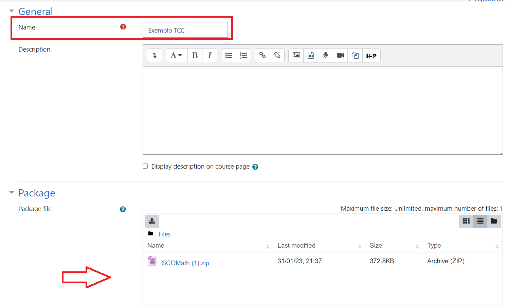
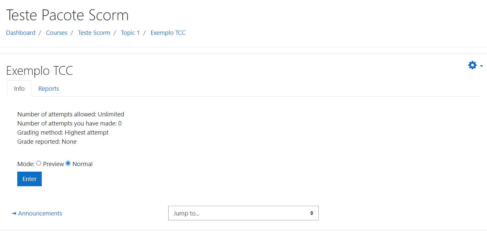
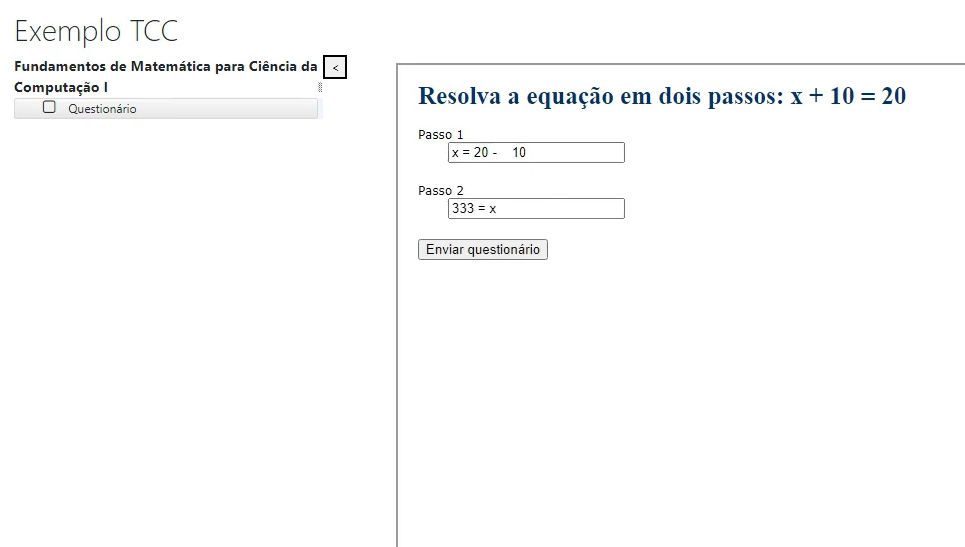
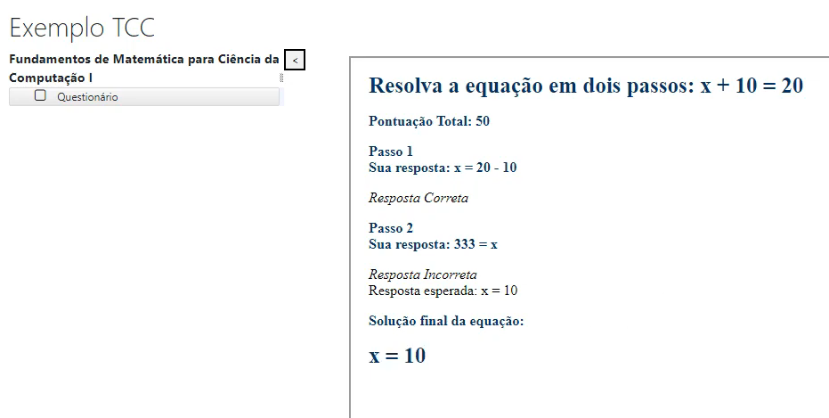

# 

<h1 align="center">SCOMath</h1>

O SCOMath é uma solução para gerar pacotes SCORM para serem utilizados em sistemas de gerenciamento de aprendizagem (LMS). Ele permite que o professor crie questões matemáticas e respostas (gabaritos), gerando um pacote pré-setado que pode ser baixado e executado em qualquer LMS compatível com o SCORM 2004. A aplicação atingiu as expectativas iniciais e foi avaliada como um MVP (Minimum Viable Product) funcional. No entanto, ainda há espaço para melhorias, como a suporte à edição de pacotes e a expansão para outros tipos de questões.

### Bibliotecas usadas

- [Flask](https://flask.palletsprojects.com/en/2.2.x/)

### Tutorial de uso
- [SCOMath](https://www.youtube.com/watch?v=56XMm8YLci0)
- [Importação de pacote no Moodle](https://www.youtube.com/watch?v=lK1Af_9_tZc)

#
## Subindo a aplicação (Professor)
Para o uso da aplicação, o usuário deverá ter o Flask instalado na sua máquina (ver 2.2.2), para a instalação do mesmo é simples basta executar o comando: **!pip install Flask==2.2.2**. 

Ao realizar a instalação, o usuário deverá levantar o servidor, indo até a pasta raiz do projeto e digitando o seguinte comando no terminal: **flask --app app --debug run**

Com a aplicação funcionando o mesmo agora basta acessar a url: **http://127.0.0.1:5000/**

Se tudo funcionou como esperado o mesmo irá se deparar com o SCOMath funcionando:

#
## Criando um questionário (Professor)
Após acessar a aplicação, o professor criará um enunciado e posteriomente definirá a quantidade total de passos. Caso tenha adicionado passos além do necessário basta pressionar o botão **-** que o passo será removido. Exemplo de preenchimento:

Ao finalizar o preenchimento, basta pressionar o botão ***Gerar pacote SCORM*** e escolher onde realizar o download do pacote gerado.

#
## Importação do pacote gerado (Professor)
Para demonstrar a adição do pacote, o LMS escolhido foi o Moodle. O professor deverá navegar até a página do curso, habilitar a edição e posteriomente clicar em "Adicionar atividade ou recurso"  

Posteriormente deve selecionar pacote SCORM e clicar em Add  

Por fim dar um nome ao questionário, assim como importar o pacote gerado no SCOMath, por fim salvar as modificações.  

Como resultado:  

#
## Exemplo de uso do pacote gerado (Aluno)
Segue o exemplo de execução de um pacote gerado. Depois de preencher os passos e o botão **Enviar questionário** ser pressionado, o usuário receberá um feedback. 

Exemplo de feedback, pós envio do questionário  

